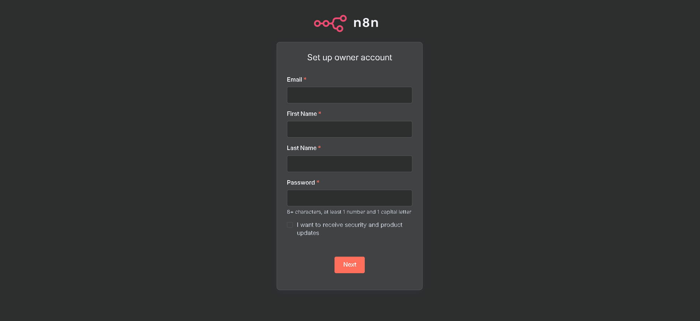
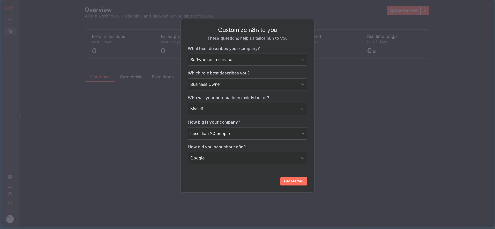
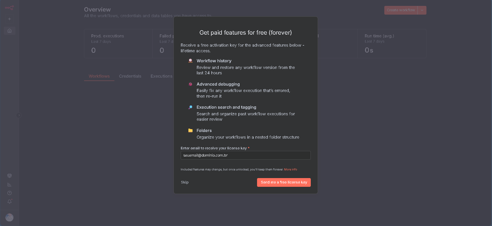
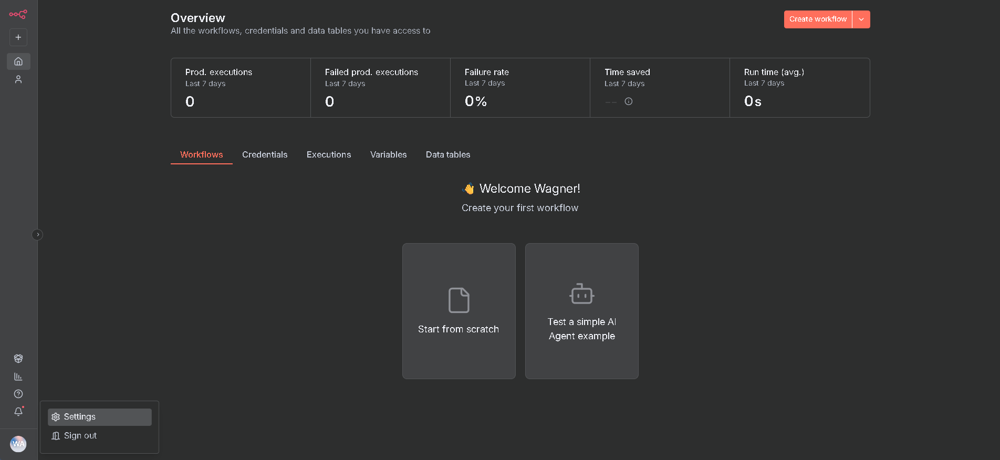
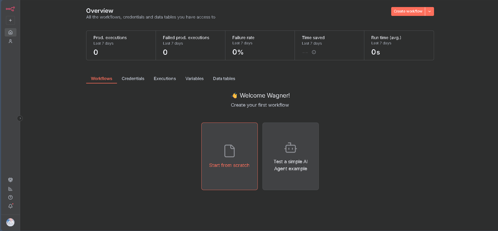

    

## ✨ n8n em Docker

### 📃 Descrição

Ambiente para criar automações n8n em Docker

### ⚙️ Pré-requisitos

- Docker

### 🔥 Como Utilizar

1. Clone o repositório

        git clone git@github.com:wsawebmaster/docker-n8n.git

2. Suba aplicação em container Docker

        docker-compose up -d

### Acessar o
Projeto: [http://localhost:5678/](http://localhost:5678/) 

No primeiro acesso exibirá um formulário para cadastro semelhante a imagem abaixo, faça seu cadastro

Exemplo para preenchimento

Confirmar para receber chave de ativação para uso da versão comunidade

Para ativar, clique no canto inferior esquerdo, Settings, Enter activation key e cole o código de ativação enviado em seu email

Clique em Start from Scratch para iniciar um novo projeto

---
---

### Encerrar containers em execução

    docker-compose down

### Rebuild

    docker-compose up --build -d

### Remover Todos os Contêineres e Imagens em Um Comando

    docker stop $(docker ps -aq) && docker rm $(docker ps -aq) && docker rmi $(docker images -q) && docker network rm $(docker network ls -q)

### 🌍 Links Úteis

- 📚 [Documentação n8n](https://docs.n8n.io)
- 🔧 [400+ Integrações](https://n8n.io/integrations)
- 💡 [Workflows Exemplo](https://n8n.io/workflows)
- 🤖 [AI & LangChain Guide](https://docs.n8n.io/advanced-ai/)
- 👥 [Fórum](https://community.n8n.io)
- 📖 [Tutoriais](https://community.n8n.io/c/tutorials/28)

---
---

### 👨‍💻 Expert

    
&nbsp&nbsp&nbsp Wagner Andrade 
    &nbsp&nbsp&nbsp
    <a href="https://github.com/wsawebmaster">
    GitHub</a>&nbsp;|&nbsp;
    <a href="https://www.linkedin.com/in/
wsawebmaster">LinkedIn</a>
&nbsp;|&nbsp;
<a href="mailto:wsawebmaster@yahoo.com.br">
    Email</a>
  &nbsp;|&nbsp;

